# ESP32C3 串口传感器驱动Demo

## 项目说明

本项目包含对ESP32C3芯片UART串口驱动的简单封装，及其在此基础上实现的三个传感器的驱动代码。
```bash
├── components
│   ├── ability_framework #能力框架(ability_context为传感器版本)
│   ├── myrpc             #rpc框架
│   ├── sensors           #传感器驱动代码.包含UART配置和相关命令读写
│   ├── udp_broadcast     #UDP广播
│   └── wifi_config       #wifi配置
├── doc
│   ├── 上位机
│   ├── 串口工具
│   └── 技术手册
├── img
├── main            #ESP侧代码
│   ├── DS18B20           #温度传感器
│   ├── FPM_383D          #指纹传感器
│   ├── LD2410B           #雷达传感器
└── main_client     #Linux测测试客户端代码
```

## 运行项目代码

### FPM-383D指纹传感器

1.硬件连线

FMP-383D的接口如下：
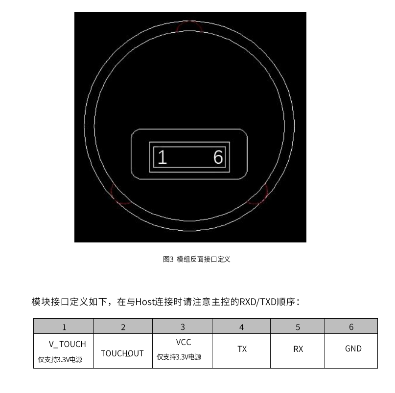

用户手册中说要给Rx加上拉电阻,这个功能应该可以通过GPIO配置实现(设置其中的poll_up相关宏),但是不清楚是否会和UART配置冲突,其他Demo也没有提到相关问题,
实测使用暂时未观察到问题,可以考虑忽略.

如果希望把ESP32C3当作转接口, 运行电脑上的上位机,按照如下方式连线:
| 厂家线6pin颜色|传感器 | ESP32C3|
|----| -----|--------|
白|V_TOUCH     |  3V3
蓝|TOUCH_OUT   | 任意
绿|VCC         | 3V3
黄|TX          | TX
黑|RX          | RX
红|GND | GND|

此时ESP32C3完全不起任何作用,不需要烧录程序,烧录了程序也不起作用.虽然电源灯正常亮起,但是ESP32C3本身的USB串口会被占用,用于在电脑和传感器之间进行通讯.

如果希望运行烧录在ESP32C3上的程序,按照如下方式连接
|厂家线6pin颜色 |传感器 | ESP32C3|
|--| -----|--------|
白|V_TOUCH     |  3V3
蓝|TOUCH_OUT   | 任意
绿|VCC         | 3V3
黄|TX          | GPIO_RXD (默认为5)
黑|RX          | GPIO_TXD (默认为4)
红|GND | GND|

此时一定要调用serial.h中的serial_init配置串口连接,FPM383D的默认波特率为57600(参考示例代码)

2. 项目配置

将项目克隆到本地.
项目将三个传感器的Demo都放在了main目录下，切换要烧录的Demo为FPM_383D.在main/CMakeLists.txt中:
```CMake
set(program FPM_383D)   #修改program的值为FPM_383D
file(GLOB_RECURSE SRCS
        ${program}/*.cpp
        ${program}/*.c
        )
idf_component_register(SRCS ${SRCS}
                    INCLUDE_DIRS "."
                    REQUIRES sensors)

```

3. 烧录程序并运行

按照ESP项目的正常流程配置开发板,进行编译和烧录,即可运行程序.
示例程序是不断进行指纹检测, 超时和识别错误提示没有识别到指纹, 匹配失败提示Match Failed, 其他情况打印匹配到的指纹ID和匹配分数(0-9999)
如果一开始没有任何指纹,请通过上位机事先录入指纹,并且可以在上位机中将灯光模式设置为默认模式,这样匹配到了闪烁绿光,没有匹配到闪烁红光.正常状态下是青色呼吸灯

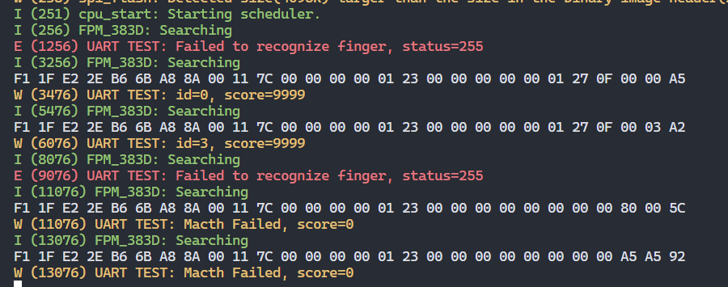

4. 上位机使用指南

   首先,请检查是否按照1.中的"上位机模式"连接了硬件
   然后,打开上位机程序(仅提供exe),选择COM号,波特率默认57600,连接硬件.
   如果Adaptor已经连接,Sensor显示未连接,请检查接线和波特率是否有问题.
   之后建议在右侧找到Policy,把Auto LEDControl打开.
   
   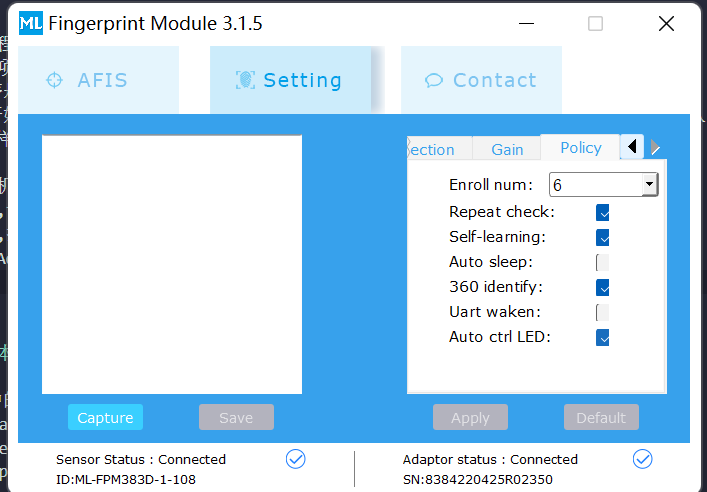
   
   之后可以使用AFIS部分的功能录入程序.上位机及其手册也放在doc文件夹内,
   也可以用url下载[手册](https://r0.hlktech.com/download/HLK-FPM383D/3/%E6%8C%87%E7%BA%B9%E4%B8%8A%E4%BD%8D%E6%9C%BA%E4%BD%BF%E7%94%A8%E6%8C%87%E5%8D%97.pdf)和[上位机程序](https://r0.hlktech.com/download/HLK-FPM383D/3/%E6%8C%87%E7%BA%B9%E4%B8%8A%E4%BD%8D%E6%9C%BA%E4%BD%BF%E7%94%A8%E6%8C%87%E5%8D%97.pdf)

5. 通信协议及进一步开发

  383C的[用户手册](https://r0.hlktech.com/download/HLK-FPM383C/1/FPM383C%E7%94%A8%E6%88%B7%E6%89%8B%E5%86%8CV1.2.pdf),经检验,和383D是一样的.可以参考用户手册获取全部通信协议相关内容. 这里建议下载我的串口工具,我已经在串口工具的"多字符串"一栏中保存了一些常用指令,可以用于调试,放在doc文件夹内.
  串口工具中的常用指令(包括全部三个模块):
  
  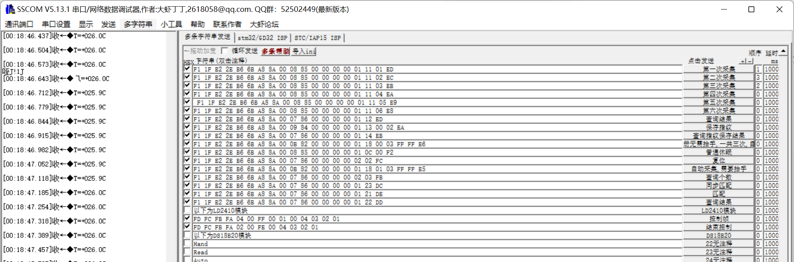
  
  注意温度传感器的指指令是ASCII码(ASC),前两个都是二进制(HEX)

  [官网](https://r0.hlktech.com/Mobile/Download)查看FPM383C的相关资料,其中有两套通讯协议:"FPM383C用户手册V1.2"(我提供的链接)和"FPM383C模组通信协议_V1.2". 经过串口通讯检验都可以使用,真的不知道是什么关系,建议还是用第一套协议,比较简洁易用,也是本代码中的指令
  
  我这里也没有提供"通信协议"的任何链接和文件,怕混淆,可以去官网查看以下.
  
  [串口工具](https://r0.hlktech.com/download/HLK-FPM383C/3/%E4%B8%B2%E5%8F%A3%E6%B5%8B%E8%AF%95%E5%B7%A5%E5%85%B7.zip)里的默认HEX指令遵循"用户手册"的协议,用来控制LED灯的.默认ASCII指令(需要复制后手动用HEX发送)是遵循"通讯协议"的协议,用来尝试匹配指纹的.

  通信协议的帧头分别是:
  `F1 1F E2 2E B6 6B A8 8A`用户手册中的通信协议
  `EF 01`通信协议中的通信协议

6. 关于没有使用的引脚

   TOUCH_OUT的电平定义是:
   - 常规模式下-恒为1
   - 浅度休眠模式下-恒为0,可以通过触摸传感器唤醒,唤醒时从0跳变到1
   - 深度休眠模式下-未说明
   可以将TOUCH_OUT连接到GPIO上并设置中断,以此实现按下手指时自动触发感应.

### LD2410B人在传感器

1. 硬件连线

  传感器引脚如图所示:
  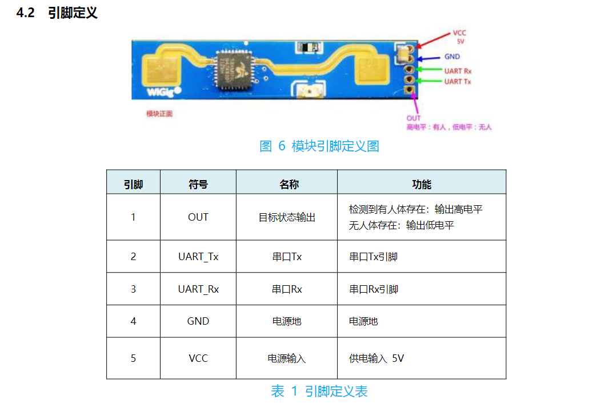

  如果希望把ESP32C3当作转接口, 运行电脑上的上位机,按照如下方式连线:
| 厂家线5pin颜色|传感器 | ESP32C3|
|----| -----|--------|
蓝|OUT   | 任意
绿|Tx    | TX
黄|RX    | RX
黑|GND  | GND
红|VCC | 5V|

此时ESP32C3完全不起任何作用,不需要烧录程序,烧录了程序也不起作用.虽然电源灯正常亮起,但是ESP32C3本身的USB串口会被占用,用于在电脑和传感器之间进行通讯.

如果希望运行烧录在ESP32C3上的程序,按照如下方式连接
| 厂家线5pin颜色|传感器 | ESP32C3|
|----| -----|--------|
蓝|OUT   | 任意
绿|Tx    | GPIO_RXD (默认为5)
黄|RX    | GPIO_TXD (默认为4)
黑|GND  | GND
红|VCC | 5V|

此时一定要调用serial.h中的serial_init配置串口连接,LD2410B默认波特率为256000(参考示例代码)

  这里虽然标明连接5V,但实测连接3V3也可以驱动.可以使用官方提供的[APP上位机](https://www.pgyer.com/Lq8p)看看有没有蓝牙信号,有信号就是正常上电了(除非手动关闭过蓝牙)

2. 项目配置

将项目克隆到本地.
项目将三个传感器的Demo都放在了main目录下，切换要烧录的Demo为LD2410B.在main/CMakeLists.txt中:
```CMake
set(program LD2410B)   #修改program的值为LD2410B
file(GLOB_RECURSE SRCS
        ${program}/*.cpp
        ${program}/*.c
        )
idf_component_register(SRCS ${SRCS}
                    INCLUDE_DIRS "."
                    REQUIRES sensors)

```

3. 烧录程序并运行

按照ESP项目的正常流程配置开发板,进行编译和烧录,即可运行程序.
示例程序是不断进行运动物体的位置获取,约一秒打印一次.将手紧贴雷达,应该观察到输出0,将手移远,可以看到数值不断增大.
这里我不确定UART在高速擦除/重写缓冲区的时候会不会出现粘包,,所以还是做了帧头检验,目前来看好像擦缓冲区的时候会阻塞写入所以不会导致粘包.

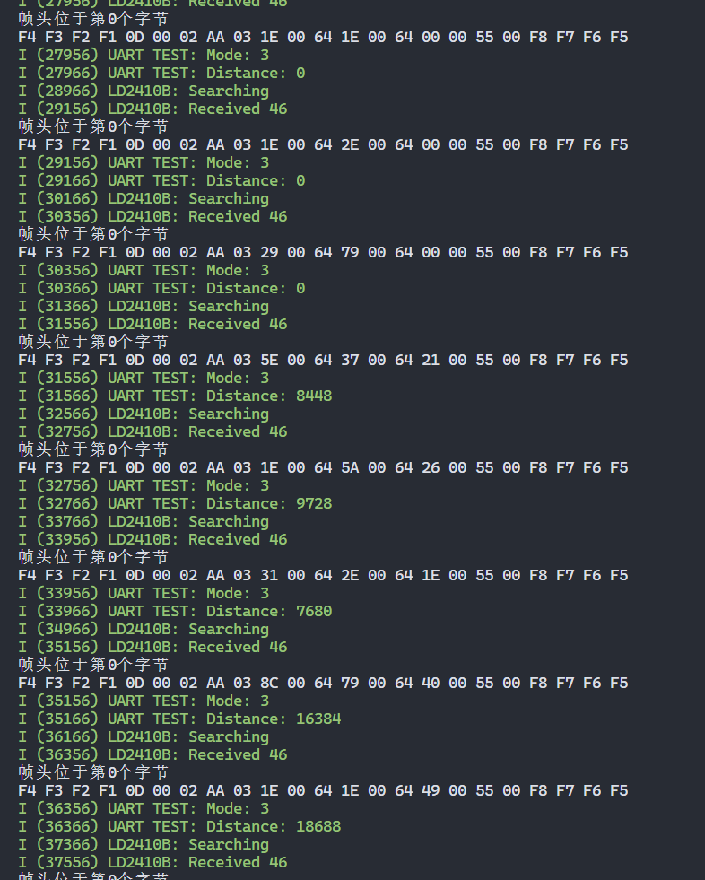


4. 通信协议及进一步开发

    [通信协议](https://r0.hlktech.com/download/HLK-LD2410B-24G/1/LD2410B%20%E4%B8%B2%E5%8F%A3%E9%80%9A%E4%BF%A1%E5%8D%8F%E8%AE%AE%20V1.06%20230221.pdf)和[说明书](https://r0.hlktech.com/download/HLK-LD2410B-24G/1/HLK%20LD2410B%E7%94%9F%E5%91%BD%E5%AD%98%E5%9C%A8%E6%84%9F%E5%BA%94%E6%A8%A1%E7%BB%84%E8%AF%B4%E6%98%8E%E4%B9%A6%20V1.07.pdf)的下载链接
    [上位器](https://r0.hlktech.com/download/HLK-LD2410B-24G/2/HLK-LD2410%20Tool.zip)的下载链接
    最好先使用上位机模式,确认连接无误后再用开发板尝试开发.
    注意传感器会以极快的速度发送报文(大约0.1秒一帧),因此建议每次接受前先清空缓冲区,再接收长度为两帧的报文,从中读出帧头,获得完整的一帧报文.

### DS18B20
1. 硬件连线

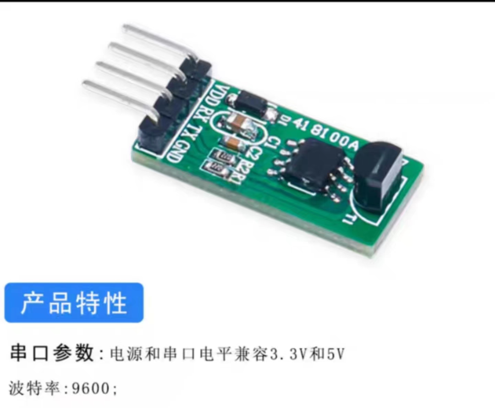

如果希望把ESP32C3当作转接口, 运行电脑上的上位机,按照如下方式连线:

|传感器|ESP32C3|
|-----|-----|
VDD   | 5V/3V3
Tx    |TX
RX    | RX
GND   | GND|

此时ESP32C3完全不起任何作用,不需要烧录程序,烧录了程序也不起作用.虽然电源灯正常亮起,但是ESP32C3本身的USB串口会被占用,用于在电脑和传感器之间进行通讯.

如果希望运行烧录在ESP32C3上的程序,按照如下方式连接
|传感器 | ESP32C3|
| -----|--------|
VCC | 5V/3V3
Tx    | GPIO_RXD (默认为5)
RX    | GPIO_TXD (默认为4)
GND  | GND|

此时一定要调用serial.h中的serial_init配置串口连接,DS18B20默认波特率为9600(参考示例代码)

2.配置项目

将项目克隆到本地.
项目将三个传感器的Demo都放在了main目录下，切换要烧录的Demo为LD2410B.在main/CMakeLists.txt中:
```CMake
set(program DS18B20)   #修改项目文件为DS18B20
file(GLOB_RECURSE SRCS
        ${program}/*.cpp
        ${program}/*.c
        )
idf_component_register(SRCS ${SRCS}
                    INCLUDE_DIRS "."
                    REQUIRES sensors)

```


3.烧录程序并运行

按照ESP项目的正常流程配置开发板,进行编译和烧录,即可运行程序.
示例程序是不断打印温度值,约一秒打印一次,示例如下:

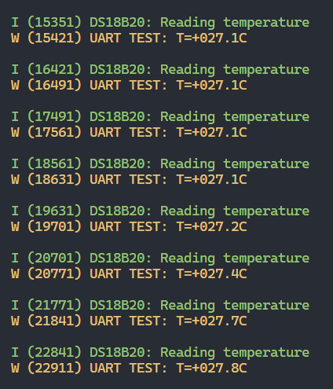

4.技术资料

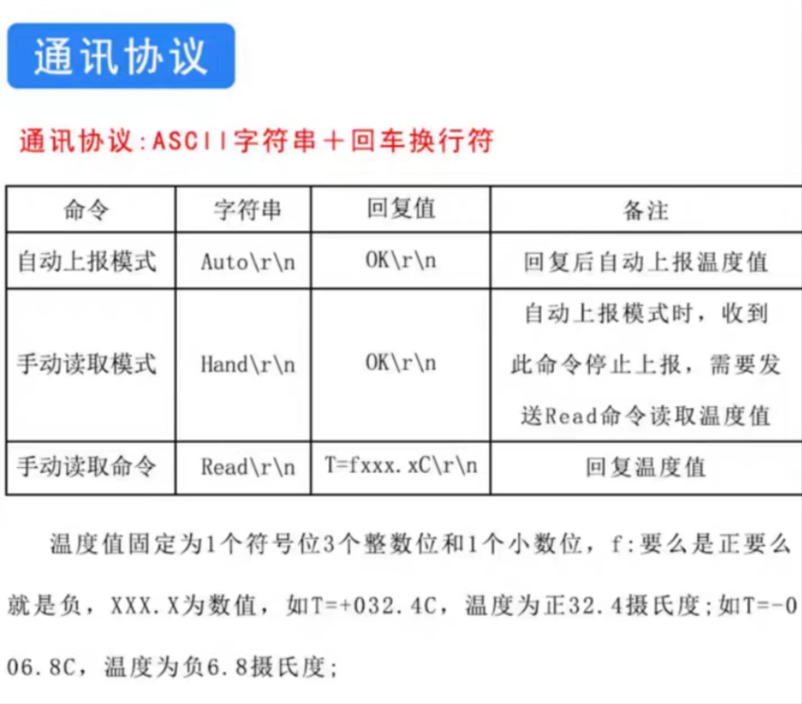


## 使用本项目

### 导入项目

将项目中的component/sensor文件夹复制到ESP项目中的component/sensor中，并在ESP项目的main/CMakeLists.txt中加入对sensor的依赖：
```CMakeLists
idf_component_register(SRCS       ...  #your srcs
                    INCLUDE_DIRS  ...  #your inc
                    REQUIRES      ...  #your dependencies
                    sensor             #add sensor to REQUIRES
                    )
```
然后就可以使用三个传感器的对应功能，详细使用方法可以参考上面的示例。

### 配置项目

可以在sensor/serial.h中配置UART相关的设置,如TXRX对应的GPIO引脚号等.

### 提供接口

FPM-383D指纹传感器：
```c
  //#include "sensor/FPM_383D.h"
  /**
   * @brief 触发一次指纹匹配
   * @param id 用于存储匹配到的ID的指针
   * @param score 用于存储匹配到的分数的指针
   * @return 返回状态码, 0x00代表成功
  */
  uint8_t PS_SearchMB(uint16_t *id, uint16_t *score);
```

LD2410B人在传感器：
```c
    /**
     * @brief 获取运动物体的距离
     * @param distance 用于存储距离值的指针
     * @return 返回运动类型, 0xFF代表失败
     */
    uint8_t getDistance(uint16_t *distance);
```

DS18B20温度传感器:
```c
/**
 * @brief 设置为手动模式
 * @return 返回状态码, 0x00代表成功, 其余表示失败
*/
uint8_t set_hand(void);

/**
 * @brief 读取一次温度并返回温度值
 * @return 温度值,读取错误返回NaN
*/
float get_temperature(void);
```

## 项目代码说明

具体代码的注释还是比较完善的,可以参考.
代码中使用的二进制串/数组下标的含义,可以参考doc/技术手册/中传感器的通信协议文档.
### Demo用到的FPM32的协议
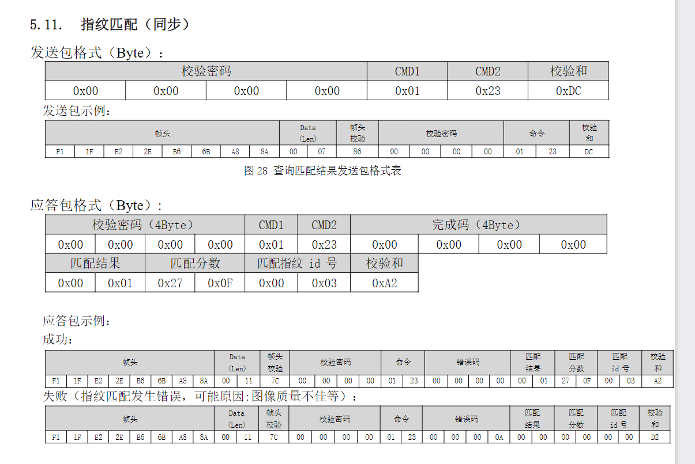
### LD2419的协议(不开启工程模式)
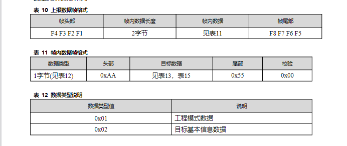
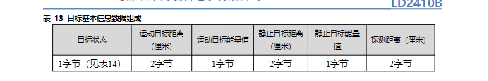
### DS18B20的协议:
比较简单,前文已述.

