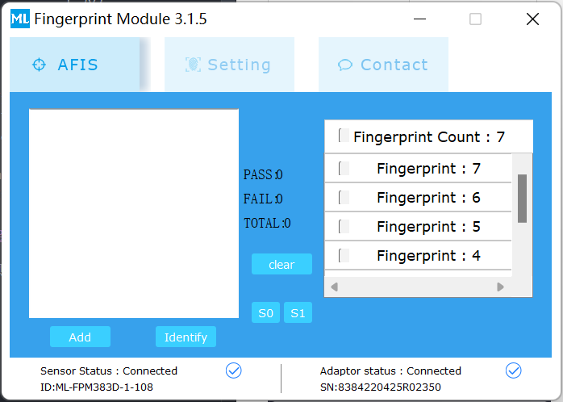

按照下列方式接线:
| 厂家线6pin颜色|传感器 | ESP32芯片|
|----| -----|--------|
白|V_TOUCH     |  3V3
蓝|TOUCH_OUT   | 任意
绿|VCC         | 3V3
黄|TX          | TX
黑|RX          | RX
红|GND | GND|

然后,打开上位机程序,选择COM号,波特率默认57600,连接硬件.应该能看到下方状态栏Sensor和Adaptor Status已经链接。
如果Adaptor已经连接,Sensor显示未连接,请检查接线和波特率是否有问题.

点击左侧AFIS栏，可以看到下面的界面，点击Add按钮即可添加指纹。

